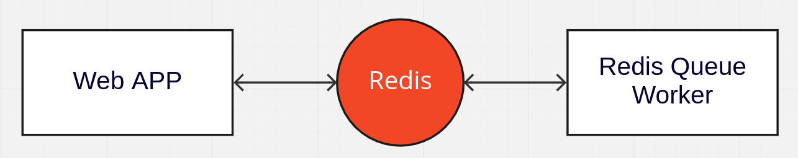

# flask-image-resize

## Arquitetura
O projeto foi criado utilizando Flask para o aplicativo web que recebe a 
requisição de redimensionamento da imagem e Redis Queue para a criar uma fila de
processamento fora da aplicação web


## Executando a aplicação no docker:
```
docker-compose up
```

## Executando a aplicação fora do docker

Inicie o container com o Redis e Redis Queue
```
docker-compose up -d redis redis-queue
```

Execute o script de configuração
```
./setup_enviroment.sh
source venv/bin/activate
```

Mude para o diretório da aplicação
```
cd src/
```

Execute o flask
```
PYTHONPATH=$(pwd) FLASK_DEBUG=1 FLASK_APP="api/app" flask run --port=8080
```
...ou o Gunicorn
```
python server.py
```

## Rodando os testes unitários
Execute o pytest
```
PYTHONPATH=src/ pytest tests/
```
